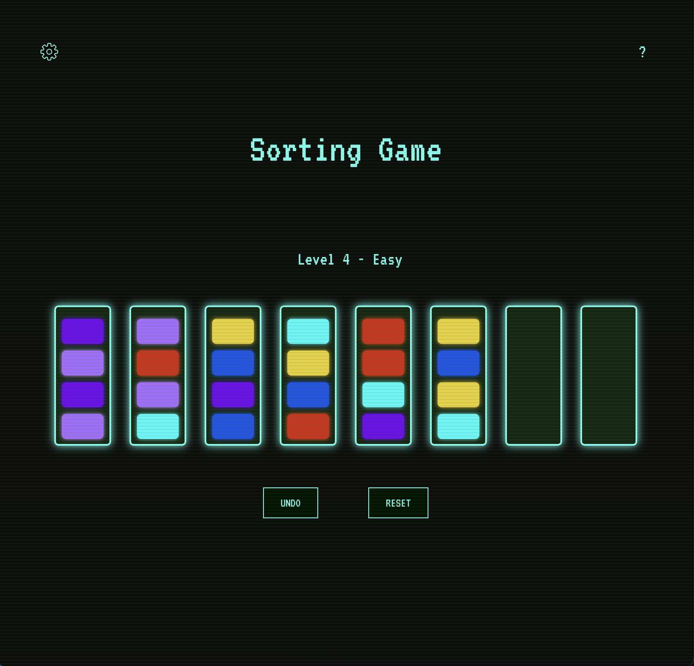

---
# Sorting Game

A browser-based puzzle game featuring dynamically generated puzzles, efficient game logic, smooth animations, and interactive user controls. The game challenges players to sort colored tiles into their respective tubes, ensuring each contains only one color. Designed with a clean and modular architecture, the game prioritizes performance, responsiveness, and user customization.

## Live Game

[Click here to play!](https://ianhallwdjun22.github.io/sorting-game)

## Features

- **Dynamically Generated Puzzles** – Ensures every playthrough is unique.
- **Customizable Visuals** – Players can switch UI themes for a personalized experience.
- **Smooth Animations** – Enhances interactivity and responsiveness.
- **Undo & Reset Functions** – Allows players to refine strategies as they play.
- **Persistent State** – Saves progress using local storage.
- **Scalable Architecture** – Built with modular components and optimized game logic.

## Game Mechanics

- **Sorting System**  
  - Players can only move tiles to an empty tube or on top of a matching tile.  
  - Moves are validated dynamically to prevent invalid placements.  
  - Each difficulty level increases in complexity with additional tubes and color variations.  

- **Game Logic & State Management**  
  - The game board state is managed using React’s `useState` and `useEffect`.  
  - Puzzle generation ensures solvability while maintaining randomization.  
  - Game state is saved in local storage to persist across sessions.  

- **User Interaction & UI**
  - Responsive styling allows this game to be played on any screen size including mobile.  
  - Click-based tube selection with animated transitions for movement feedback.  
  - Toggle-based settings allow theme switching and audio control.  
  - A settings modal and an instructions modal provide intuitive user guidance.  

- **Customization**  
  - Theme settings modify UI colors dynamically via CSS variables.  
  - Gameplay settings allow users to switch off of level-based difficulty mode for a varied experience.
  - Audio settings allow players to mute or unmute background music and/or sound effects.

## Tech Stack

- **Languages**: React, JavaScript, HTML, CSS  
- **State Management**: React Hooks (`useState`, `useEffect`)  
- **Storage**: LocalStorage for persistent game state  
- **Animation**: CSS animations for UI feedback  
- **Deployment**: Hosted on GitHub Pages  

## Roadmap

- **Organize Stylesheets** – Organize styling using Sass partials for improved clarity and scalability.
- **Organize Components** – Break GameBoard.jsx into individual components for better orginization and clarity.
- **Accessibility Considerations** – Include high-contrast mode for better visibility.
- **Expanded Theme Options** – Introduce additional visual styles beyond the current selections.  
- **Challenge Modes** – Implement timed puzzles or limited-move challenges for added difficulty. 
---